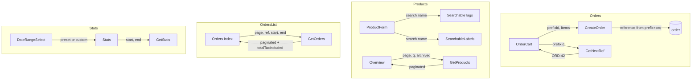

# Inventory improvements

## 1. Schema and migration

**New table: `inventory_order_reference_prefix`**

- `id` (uuid, PK), `user_id` (text, FK user, cascade), `prefix` (text, e.g. `"ORD"`), `sort_order` (integer, default 0). Unique on `(user_id, prefix)`.
- File: [src/server/db/schema/inventory.ts](src/server/db/schema/inventory.ts) — add table and relations; export from [src/server/db/schema.ts](src/server/db/schema.ts) if needed.
- Migration: `.drizzle/0006_inventory_reference_prefix_archived_sku.sql` (create table, indexes).

**Product**

- `archived_at` (timestamp, nullable). When set, product is archived.
- `sku`: keep column nullable in DB for now; enforce in app (zod + UI). Optional: migration to backfill `sku` where null (e.g. `'LEGACY-' || id`) and `ALTER COLUMN sku SET NOT NULL` for strict DB constraint.

**Reference**

- [src/server/db/schema/inventory.ts](src/server/db/schema/inventory.ts): add `inventoryOrderReferencePrefix`, relations. In [product](src/server/db/schema/inventory.ts): add `archivedAt` and index `product_userId_archivedAt_idx` (or `product_archivedAt_idx`) to support filtered lists.

---

## 2. Order reference prefixes (backend)

**Server functions in** [src/server/functions/inventory.ts](src/server/functions/inventory.ts):

- **`$getOrderReferencePrefixes`** (GET): return prefixes for user, ordered by `sort_order`, then `prefix`.
- **`$createOrderReferencePrefix`** (POST): `{ prefix, sortOrder? }`; `prefix` 1–20 chars, alphanumeric + `-`/`_`; unique per user.
- **`$updateOrderReferencePrefix`** (POST): `{ id, prefix?, sortOrder? }`.
- **`$deleteOrderReferencePrefix`** (POST): `{ id }`; forbid if it is the last prefix (or require ≥1 to create orders).
- **`$getNextOrderReference`** (GET): `data: { prefixId }`. Resolve prefix, then in a transaction:

`SELECT reference FROM order WHERE user_id = ? AND reference LIKE prefix || '-%' ORDER BY reference DESC LIMIT 1`

parse trailing number, `next = (n || 0) + 1`, return `{ prefix }-{ next }`. Handle no rows and empty prefix list.

**`$createOrder`**

- Make `reference` optional in `orderCreateSchema`. If `reference` is provided, keep current behavior (unique check, use as-is). If not provided:
  - Require `prefixId` in `data`.
  - Call same “next reference” logic as `$getNextOrderReference` inside the create transaction and use that `reference` for the insert. Enforce unique `(user_id, reference)`; on conflict, retry once with next seq or return `badRequest`.

---

## 3. Order reference prefixes (UI)

**Reference prefix management**

- New route: `src/routes/_authed/inventory/settings/route.tsx` (or `settings.tsx` under `inventory`). Section “Order reference prefixes”: table of prefix, sort order, actions (edit, delete); “Add prefix” (dialog or inline). Use `$getOrderReferencePrefixes`, `$createOrderReferencePrefix`, `$updateOrderReferencePrefix`, `$deleteOrderReferencePrefix`. Link from sidebar or from Orders / New order: “Manage prefixes”.

**Order cart** [src/components/apps/inventory/order-cart.tsx](src/components/apps/inventory/order-cart.tsx)

- Remove free-text reference input.
- Add **Prefix** `SearchableSelect` (or plain `Select`): options from `$getOrderReferencePrefixes`. Required.
- Optional: when prefix is selected, call `$getNextOrderReference({ prefixId })` and show “Reference: ORD-42” as preview. If no prefixes, disable create and show “Add a reference prefix in Inventory settings.”
- `createMut.mutate({ data: { prefixId, description, status, items } })` when reference is auto; `reference` stays optional in schema.

---

## 4. SKU mandatory

- **Zod** (product create/update in [src/server/functions/inventory.ts](src/server/functions/inventory.ts)): `sku: z.string().min(1).max(200)` (remove `optional()`).
- **Product form** [src/components/apps/inventory/product-form.tsx](src/components/apps/inventory/product-form.tsx): SKU `Input` `required`, remove “Optional” placeholder.

---

## 5. Searchable selects (tags, production-cost, product)

**Reusable `SearchableSelect`**

- New: `src/components/ui/searchable-select.tsx`. API:
  - **Sync (tags, labels):** `options: { value, label }[]`, `value`, `onChange`, `placeholder`, `emptyText?`. Popover + `Input` to filter; list filtered with `@tanstack/match-sorter-utils` (rankItem, filter). Optional `onCreate` (e.g. “Create tag …”) that adds an option and calls parent.
  - **Async (products in order-cart):** `loadOptions: (q: string) => Promise<{ value, label }[]>`, `value`, `onChange`, `placeholder`, `emptyText?`. Debounced (≈300ms) `loadOptions` on input; show loading and results. Product variant also needs to show e.g. “name (SKU · stock: n)” in the label.
- Use existing [Popover](src/components/ui/popover.tsx), [Input](src/components/ui/input.tsx), [Button](src/components/ui/button.tsx). Match look of [Select](src/components/ui/select.tsx).

**Product form**

- **Tags:** replace toggle buttons + “Create tag” with `SearchableSelect` (sync): `options = tags.map(t => ({ value: t.id, label: t.name }))`, multi-select or “add on choose” and display as chips. Keep “Create tag” via `onCreate` that calls `$createInventoryTag` and appends to `options`/`tagIds`. Filter by `name`.
- **Production cost rows:** replace each `Select` (label) with `SearchableSelect` (sync): `options = labels.map(l => ({ value: l.id, label: l.name }))`, filter by `name`. Keep “Create label” via `onCreate` and “Add” row as today.
- **Product (order-cart):** replace `Select` with `SearchableSelect` (async): `loadOptions = (q) => $getProducts({ data: { search: q, archived: 'active', size: 50 } })` and map to `{ value: p.id, label: \`${p.name} (${p.sku}) · stock: ${p.quantity}\` }`. Exclude archived. Filter by name/SKU on server.

---

## 6. Product archiving

**Backend**

- [src/server/db/schema/inventory.ts](src/server/db/schema/inventory.ts): `product.archivedAt` (timestamp, nullable).
- [src/server/functions/inventory.ts](src/server/functions/inventory.ts):
  - **`$updateProduct`**: extend `productUpdateSchema` with `archivedAt: z.boolean().optional()`. If `true` → `archivedAt = new Date()`; if `false` → `archivedAt = null`.
  - **`$createOrder`**: when resolving products, add `and(isNull(product.archivedAt))`; if any requested product is missing (archived or not found), `badRequest`.
  - **`$getProducts`**: add params `page`, `size`, `search`, `archived`:
    - `archived: 'all' | 'active' | 'archived'` (default `'all'` for backward compat or `'active'` for order-cart). Map to `isNull(archivedAt)`, `isNotNull(archivedAt)`, or no filter.
    - `search`: `ilike` on `name` or `sku` (escape `%`/`_`), e.g. `or(ilike(product.name, '%'||q||'%'), ilike(product.sku, '%'||q||'%'))`.
    - Use [paginated](src/server/db/utils.ts) from `@/server/db` if the `where` can be expressed as `SQL` (product has `id`). Return `{ items, total, page, size, totalPages }`. Ensure `productListFields` includes `archivedAt` and that `paginated`’s `select` matches (it uses full table row; product table fits).

**Product form / detail**

- [src/routes/\_authed/inventory/products/$productId.tsx](src/routes/_authed/inventory/products/$productId.tsx) or product-form: add “Archive” / “Unarchive” button. Call `$updateProduct({ data: { id: productId, archivedAt: true|false } })`, invalidate, toast. In product form, if `existing.product.archivedAt`: show “Unarchive” and optionally restrict editing (or allow full edit and unarchive on save). UX choice: allow editing when archived (simpler).

**Overview and order-cart**

- Overview: pass `archived` from filters (see below). Order-cart: `$getProducts` with `archived: 'active'` and `search` from the product `SearchableSelect`.

---

## 7. Overview: pagination and filters

**Server**

- `$getProducts` already extended above: `page`, `size`, `search`, `archived`. Implement with `paginated` + `and(eq(product.userId, user.id), searchCond, archivedCond)`.

**Route** [src/routes/\_authed/inventory/index.tsx](src/routes/_authed/inventory/index.tsx)

- `validateSearch`: `page`, `size`, `q` (search), `archived: 'all'|'active'|'archived'` (default `'all'`).
- `loaderDeps: ({ search }) => ({ search })`, `loader`: `getProductsQueryOptions({ page, size, search: q || undefined, archived })` (adapt key/params to new `$getProducts`). Use `keepPreviousData` in `getProductsQueryOptions`.
- **Filters:** Input “Search (name or SKU)”, Select “Archived: All | Active | Archived”. `useDebouncedEffect` for `q` (reset `page` to 1), same pattern as [UsersList](src/components/admin/users-list.tsx). Clear button when filters set.
- **Data/Table:** `data={productsPage.items}`. Summary cards: derive `total` and `lowStock` from `productsPage` (or from `items`; if we need full-list stats, add a small `$getProductsSummary` or compute on the first page only for a rough hint—simplest: compute on current `items` and optionally add `total` for “X products” in the header).
- **Pagination:** Reuse the pagination pattern from [UsersList](src/components/admin/users-list.tsx): Prev/Next, “Page X / Y • Z products”, `setSearch({ page })`. DataTable stays as-is; no change to `DataTable` itself.

**Query options**

- `getProductsQueryOptions` must accept `{ page, size, search, archived }` and pass to `$getProducts`. QueryKey: `[...productsQueryKey, { page, size, search, archived }]`.

---

## 8. Orders: pagination and filters

**Server**

- **`$getOrders`** (or a new `$getOrdersPage`): params `page`, `size`, `reference` (ilike, optional), `startDate`, `endDate` (ISO strings, optional). Filter:
  - `and(eq(order.userId, user.id), referenceCond, gte(order.createdAt, startDate), lte(order.createdAt, endDate))` with `undefined` where not provided.
- Orders need `totalTaxIncluded` per row. Reuse the pattern from current `$getOrders`: for the **paginated** subset of orders, run the existing aggregation for `totalTaxIncluded` and attach. Implementation: (1) `COUNT(*)` with same `where`; (2) `SELECT id FROM order WHERE ... ORDER BY createdAt DESC LIMIT size OFFSET (page-1)*size`; (3) for those ids, `SUM(quantity*unitPriceTaxIncluded)` grouped by orderId; (4) join and return `{ items: ordersWithTotal, total, page, size, totalPages }`. Can’t use generic `paginated` as-is because of the extra `totalTaxIncluded`; implement a custom `getOrdersPaginated` helper or inline in the handler.

**Route** [src/routes/\_authed/inventory/orders/index.tsx](src/routes/_authed/inventory/orders/index.tsx)

- `validateSearch`: `page`, `size`, `reference` (q), `startDate`, `endDate` (ISO or date strings). For “arbitrary range” we need `startDate`/`endDate` in URL; presets will set these (see Date range UX below).
- `loader`: `getOrdersQueryOptions({ page, size, reference, startDate, endDate })` → `$getOrders` (or `$getOrdersPage`). `keepPreviousData`.
- **Filters:** “Reference” (input, debounced), “Date range” (start + end). Use the shared **Date range** component (Section 10).
- **Table:** `data={ordersPage.items}`, columns unchanged; fix `OrderRow` type to include `totalTaxIncluded` and optional `id` for `onRowClick`.
- **Pagination:** Same pattern as Overview (Prev/Next, “Page X / Y • Z orders”).

**Query options**

- `getOrdersQueryOptions({ page, size, reference, startDate, endDate })`, key includes those. `$getOrders` is replaced or overloaded to support both the “page” shape and, if needed, a legacy “all” for a different route—prefer a single `$getOrders` that always returns `{ items, total, page, size, totalPages }`.

---

## 9. Stats: arbitrary range + presets (including “last year”)

**Presets**

- Extend `Preset`: `'today' | 'week' | 'month' | 'year' | 'lastYear'`.
- `getRange(preset)`: add `'lastYear'` → calendar year preceding the current one (e.g. 2024-01-01 00:00 → 2024-12-31 23:59).

**Route** [src/routes/\_authed/inventory/stats.tsx](src/routes/_authed/inventory/stats.tsx)

- **validateSearch:** `preset` (optional, default `'month'`), `startDate`, `endDate` (optional, ISO). Rules: if `startDate` and `endDate` are both set, use them and ignore `preset`; otherwise use `preset` to compute `start`/`end` and set `startDate`/`endDate` in loader output for the fetch. Stats API stays `startDate`/`endDate` only.
- **Loader:** If `startDate` and `endDate` in search: use as-is. Else: `getRange(search.preset)`, then set `startDate = start.toISOString()`, `endDate = end.toISOString()` and pass to `getInventoryStatsQueryOptions`.
- **UI:**
  - Presets: Select with Today, This week, This month, This year, **Last year**.
  - **Arbitrary range:** Two date pickers (or one “From–To” range picker). On change, `navigate({ to: '.', search: { startDate, endDate, preset: undefined } })` so presets are cleared when user picks custom dates. When a preset is chosen, set `startDate`/`endDate` from `getRange` and `navigate` (preset can stay in URL for display).

---

## 10. Date range UX (shared)

**Component: `DateRangeSelect`**

- New: `src/components/ui/date-range-select.tsx`. Props: `start`, `end`, `onChange: (start: Date, end: Date) => void`, `presets?: { id: Preset, label }[]`, `showPresets?: boolean`.
  - Renders: (1) Optional preset `Select` (Today, Week, Month, Year, Last year) that calls `onChange(...getRange(preset))`; (2) “From” and “To” date pickers. Reuse [Calendar](src/components/ui/calendar.tsx) in `mode="single"` (or `range` if we add it) inside Popovers; [CalendarSelect](src/components/ui/calendar-select.tsx) is single-date—use two Popover+Calendar for From/To. When the user changes From/To, `onChange` with the new range; when a preset is picked, `onChange` with `getRange(preset)`.
  - If `showPresets` is false, only show From/To (e.g. for orders).
  - `getRange` can live in `@/lib/utils/date-range` or in the component; it must include `lastYear`.

**Usage**

- **Stats:** `DateRangeSelect` with `showPresets: true`, `presets` including “Last year”. Sync with route search: `start`/`end` from `startDate`/`endDate`; `onChange` → `navigate({ search: { startDate: s.toISOString(), endDate: e.toISOString() } })`.
- **Orders:** `DateRangeSelect` with `showPresets: true` (reuse same presets). `onChange` → `navigate({ search: { startDate, endDate, page: 1 } })`. `startDate`/`endDate` are optional in `validateSearch`; omit or use `''` when “no filter”. `DateRangeSelect` can support “no range” (nulls) and `onChange(null, null)` to clear, which clears `startDate`/`endDate` in search.

---

## 11. Files to add

- `src/server/db/schema/inventory.ts`: `inventoryOrderReferencePrefix`, `product.archivedAt`, relations.
- `.drizzle/0006_*.sql`: create `inventory_order_reference_prefix`; `ALTER TABLE product ADD COLUMN archived_at ...`; index on `(user_id, archived_at)` or `archived_at`; optional SKU backfill + NOT NULL.
- `src/components/ui/searchable-select.tsx`: sync and async variants (or one with `options` | `loadOptions`).
- `src/components/ui/date-range-select.tsx`: presets + From/To, `getRange` including `lastYear`.
- `src/routes/_authed/inventory/settings/route.tsx` (or `settings.tsx`): Reference prefixes CRUD UI. Add “Settings” or “Prefixes” under Inventory in [app-sidebar](src/components/app-sidebar.tsx) or a link from Orders / New order.

---

## 12. Files to modify

- [src/server/db/schema/inventory.ts](src/server/db/schema/inventory.ts): `inventoryOrderReferencePrefix`, `product.archivedAt`, indexes, relations.
- [src/server/functions/inventory.ts](src/server/functions/inventory.ts): prefix CRUD + `$getNextOrderReference`; `$createOrder` reference optional + `prefixId`, generation; `$getProducts` with `page`, `size`, `search`, `archived` and `paginated`; `$getOrders` with `page`, `size`, `reference`, `startDate`, `endDate` and custom pagination + `totalTaxIncluded`; `$updateProduct` `archivedAt`; `$createOrder` exclude archived products; product create/update zod `sku` required.
- [src/components/apps/inventory/product-form.tsx](src/components/apps/inventory/product-form.tsx): SKU required; tags and production-cost rows → `SearchableSelect`; Archive/Unarchive if `productId` (or in the product route).
- [src/components/apps/inventory/order-cart.tsx](src/components/apps/inventory/order-cart.tsx): remove reference input; Prefix `SearchableSelect`; product `SearchableSelect` (async) with `$getProducts`; optional `$getNextOrderReference` preview; `createMut` with `prefixId` when reference is auto.
- [src/routes/\_authed/inventory/index.tsx](src/routes/_authed/inventory/index.tsx): `validateSearch` (page, size, q, archived), loader with `getProductsQueryOptions`, filters (search, archived), pagination, `productsPage.items` for DataTable; summary from `items` or new `total`/`lowStock` from server.
- [src/routes/\_authed/inventory/orders/index.tsx](src/routes/_authed/inventory/orders/index.tsx): `validateSearch` (page, size, reference, startDate, endDate); loader with new `$getOrders` params; filters (reference, `DateRangeSelect`); pagination; `ordersPage.items`.
- [src/routes/\_authed/inventory/stats.tsx](src/routes/_authed/inventory/stats.tsx): `validateSearch` (preset, startDate, endDate); loader logic “custom range vs preset”; `DateRangeSelect` with presets including “Last year”; `getRange` extended for `lastYear`.
- [src/components/app-sidebar.tsx](src/components/app-sidebar.tsx) or inventory nav: link to Inventory Settings (prefixes).
- [src/routes/\_authed/inventory/products/$productId.tsx](src/routes/_authed/inventory/products/$productId.tsx) or product-form: Archive/Unarchive button and `$updateProduct` with `archivedAt`.

---

## 13. Data flow (high level)

---

## 14. Order of implementation

1. Migration: reference_prefix table, product.archivedAt (and optional sku NOT NULL).
2. Schema: inventory.ts updates.
3. Server: prefix CRUD + `$getNextOrderReference`; `$createOrder` changes; `$getProducts` paginated + search + archived; `$getOrders` paginated + reference + date; `$updateProduct` archivedAt; product zod sku required; `$createOrder` exclude archived.
4. `SearchableSelect` and `DateRangeSelect` (+ `getRange` with `lastYear`).
5. Inventory Settings route and prefix CRUD UI; sidebar link.
6. Order-cart: prefix select, product SearchableSelect, remove reference, `createMut` with `prefixId` and optional preview.
7. Product-form: SKU required; tags and labels SearchableSelect; Archive/Unarchive on product detail.
8. Overview: search/archived filters, pagination, `getProductsQueryOptions` + `$getProducts` wiring.
9. Orders: reference + date filters, `DateRangeSelect`, pagination, `$getOrders` wiring.
10. Stats: `DateRangeSelect`, presets including Last year, arbitrary start/end in search.
