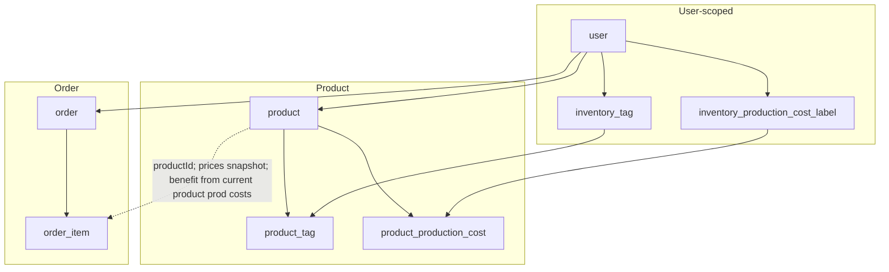

# Inventory mini-app for Miniverso

## 1. Data model

### 1.1 Product

- **product** (user-scoped): `id`, `userId`, `name`, `description` (optional), `sku` (optional), `priceTaxFree` (numeric 10,2), `vatPercent` (numeric 5,2, 0–100), `quantity` (integer, ≥ 0, default 0), `createdAt`, `updatedAt`.
- **Price tax included**: computed as `priceTaxFree * (1 + vatPercent/100)` (never stored).
- **Production costs**: label + amount per unit. Stored via **inventory_production_cost_label** (user-scoped: `id`, `userId`, `name`, `color` text) and **product_production_cost** (join: `productId`, `productionCostLabelId`, `amount` numeric 10,2). One row per (product, label); per-unit cost for a product = sum of `amount` over its rows.
- **Tags**: many-to-many. **inventory_tag** (user-scoped: `id`, `userId`, `name`, `color`). **product_tag** (join: `productId`, `tagId`), PK `(productId, tagId)`.
- **Stock**: `quantity`; enforced ≥ 0 in app logic; deducted only when an order is marked **paid**.

**Possible extra fields (you can skip for v1):** `image` (URL or storage), `currency` at user/app level (for now, assume one currency in display).

### 1.2 Order

- **order**: `id`, `userId`, `reference` (unique per user), `status` (`'prepared' | 'paid'`), `description` (optional), `createdAt`, `paidAt` (nullable; set when `status` → `paid`).
- **order_item**: `id`, `orderId`, `productId`, `quantity`, `unitPriceTaxFree`, `unitPriceTaxIncluded` (numeric 10,2). **Prices are snapshot at order creation** so revenue = what was actually charged. **No `unitProductionCost`** — benefit uses **current** product production costs (on-the-fly).
- **Order totals**:
  - **Revenue** (from snapshots): tax-free = sum of `quantity * unitPriceTaxFree`; with tax = sum of `quantity * unitPriceTaxIncluded`.
  - **Benefit** (on-the-fly): for each item, get the product’s **current** sum of `product_production_cost.amount`; `benefit += quantity * (unitPriceTaxIncluded - currentUnitProductionCost)`. If the product was deleted, treat `currentUnitProductionCost = 0`.

**Why:** Revenue must stay historically accurate (what customers paid). Production costs are your internal model; when you correct them, benefit should reflect that. Recomputing benefit from current prod costs avoids “frozen” stats based on outdated cost data.

**Stock:** decrement `product.quantity` only when an order moves to `paid` (in a transaction, with checks so quantity never goes negative). If an order is reverted from `paid` → `prepared` (or deleted), increment back.

### 1.3 Indexes and constraints

- `product`: index on `userId`; check `quantity >= 0` in app (or DB check constraint).
- `order`: index on `userId`; unique `(userId, reference)`.
- `order_item`: index on `orderId`.
- `inventory_tag`, `inventory_production_cost_label`: index on `userId`; unique `(userId, name)` for tags/labels if you want unique names per user.
- `product_tag`, `product_production_cost`: indexes on `productId` and on the foreign key used in joins.

---

## 2. DB schema and migration

- New file: [src/server/db/schema/inventory.ts](src/server/db/schema/inventory.ts)
  - Tables: `inventoryTag`, `inventoryProductionCostLabel`, `product`, `productTag`, `productProductionCost`, `order`, `orderItem`.
  - `orderItem`: `productId`, `quantity`, `unitPriceTaxFree`, `unitPriceTaxIncluded` only (no `unitProductionCost`).
  - Use `numeric({ precision: 10, scale: 2 })` for money, `text` for `color` (e.g. `#RRGGBB`).
  - Relations: `product` → `user`; `order` → `user`; `orderItem` → `order`, `product`; `productTag` → `product`, `inventoryTag`; `productProductionCost` → `product`, `inventoryProductionCostLabel`; and `userRelations_*` for the `user` table (same style as [time.ts](src/server/db/schema/time.ts)).
- Re-export in [src/server/db/schema.ts](src/server/db/schema.ts).
- Run `bun db generate` then `bun db migrate` to get a new migration under `.drizzle/`.

---

## 3. Server functions

New file: [src/server/functions/inventory.ts](src/server/functions/inventory.ts) (or split into `inventory-product.ts`, `inventory-order.ts`, `inventory-stats.ts` if it grows). Reuse `$$auth`, `$$rateLimit`, `validate`, `db`, `takeUniqueOr`, `takeUniqueOrNull` from [time-entry.ts](src/server/functions/time-entry.ts) and [db/utils](src/server/db/utils.ts).

**Tags & production cost labels**

- `getInventoryTagsQueryOptions` / `$getInventoryTags` (list by user).
- `$createInventoryTag`, `$updateInventoryTag`, `$deleteInventoryTag` (by id, user-scoped).
- Same for **inventory production cost labels**: `$getProductionCostLabels`, `$createProductionCostLabel`, `$updateProductionCostLabel`, `$deleteProductionCostLabel`.

**Products**

- `getProductsQueryOptions` (list by user; optionally join tags and production costs, or load in separate queries).
- `getProductQueryOptions` (single by id, user-scoped) with tags and production costs.
- `$createProduct`: input includes `name`, `description?`, `sku?`, `priceTaxFree`, `vatPercent`, `quantity`, `tagIds[]`, `productionCosts: { labelId, amount }[]`. Insert product, then `product_tag` and `product_production_cost`. Validate `quantity >= 0`, `priceTaxFree >= 0`, `vatPercent` in 0–100.
- `$updateProduct`: same shape; replace tags and production costs (delete+insert or upsert). Enforce `quantity >= 0`. Reject if product is in a **paid** order and a change would break consistency (or restrict which fields are editable after that)—for v1 you can allow edits and document that past order snapshots stay as-is.
- `$deleteProduct`: only if user owns it; if it appears in order_items, keep `productId` and accept that product detail may be null in UI (“Deleted product” fallback).
- Helpers: `priceTaxIncluded(priceTaxFree, vatPercent)`, `productUnitProductionCost(productionCosts)`.

**Orders**

- `getOrdersQueryOptions` (by user, with `order_item` and optional `product` for names).
- `getOrderQueryOptions` (single by id, user-scoped, with items and product snapshots/names).
- `$createOrder`: `reference`, `description?`, `status: 'prepared' | 'paid'`, `items: { productId, quantity }[]`.
  - Validate `(userId, reference)` unique, `quantity > 0`, and for each item: `product` exists, user-owned, and `product.quantity >= quantity` (when `status === 'paid'`; for v1 only enforce when `status === 'paid'`).
  - For each item: read product’s `priceTaxFree`, `vatPercent`; set `unitPriceTaxFree`, `unitPriceTaxIncluded` only (no `unitProductionCost`).
  - If `status === 'paid'`: in the same transaction, set `order.paidAt = now`, and for each item `UPDATE product SET quantity = quantity - order_item.quantity WHERE id = productId`; if any `quantity` would go negative, rollback.
- `$updateOrder`: allow switching `prepared` → `paid` (set `paidAt`, decrement stock; same checks as above). Optionally allow editing `reference`, `description`, `items` only when `status === 'prepared'`; if `items` change, recompute and snapshot `unitPriceTaxFree`/`unitPriceTaxIncluded` on `order_item` and ensure no double deduction.
- `$deleteOrder`: only when `status === 'prepared'`; if you later allow deleting `paid` orders, add logic to restore `product.quantity` from `order_item` (and perhaps a “cancelled” status instead of hard delete).

**Stats**

- `getInventoryStatsQueryOptions` / `$getInventoryStats`: inputs `startDate`, `endDate` (and optionally preset: `today`, `week`, `month`, `year`).
  - Filter: `order.status = 'paid'` and `order.paidAt` between `startDate` and `endDate`.
  - **Revenue** (from `order_item` snapshots):
    - `totalSalesTaxIncluded` = sum(`quantity * unitPriceTaxIncluded`);
    - `totalSalesTaxFree` = sum(`quantity * unitPriceTaxFree`).
  - **Benefit** (on-the-fly): for each `order_item` in range, join `product` and sum `product_production_cost.amount` as `currentUnitProductionCost`; `totalBenefit += quantity * (unitPriceTaxIncluded - currentUnitProductionCost)`. If product is deleted, use `currentUnitProductionCost = 0`.
  - **Top products by revenue**: group by `productId`, sum `quantity` and `quantity * unitPriceTaxIncluded`; join `product` for name.
  - **Top products by benefit**: same grouping, but for each product’s lines use `quantity * (unitPriceTaxIncluded - currentUnitProductionCost)` where `currentUnitProductionCost` comes from the product’s **current** `product_production_cost` rows.
  - Return structured object for charts/tables.

---

## 4. Routes and navigation

- **Layout (under `_authed`):** [src/routes/\_authed/inventory/route.tsx](src/routes/_authed/inventory/route.tsx): `loader` returns `crumb: 'Inventory'`; `Outlet` for children. No `search`/`params` required unless you add timezone or currency later.
- **Overview:** [src/routes/\_authed/inventory/index.tsx](src/routes/_authed/inventory/index.tsx) — product `DataTable` (reuse [data-table.tsx](src/components/data/data-table.tsx)), summary cards (total products, low-stock count, recent orders), “Add product” → `/inventory/products/new`.
- **Product:**
  - [src/routes/\_authed/inventory/products/$productId.tsx](src/routes/_authed/inventory/products/$productId.tsx): load product (and tags, production costs), product form (view/edit), `crumb` = product name.
  - [src/routes/\_authed/inventory/products/new.tsx](src/routes/_authed/inventory/products/new.tsx): create form, `crumb: 'New product'`.
- **Orders:**
  - [src/routes/\_authed/inventory/orders/route.tsx](src/routes/_authed/inventory/orders/route.tsx): `crumb: 'Orders'`, `Outlet`.
  - [src/routes/\_authed/inventory/orders/index.tsx](src/routes/_authed/inventory/orders/index.tsx): orders list (table: reference, status, dates, totals).
  - [src/routes/\_authed/inventory/orders/new.tsx](src/routes/_authed/inventory/orders/new.tsx): “cart” — product picker, quantities, reference, description; “Create as prepared” / “Create and mark paid”.
  - [src/routes/\_authed/inventory/orders/$orderId.tsx](src/routes/_authed/inventory/orders/$orderId.tsx): order detail, lines, “Mark as paid” when `prepared`, optional “Edit” when `prepared`.
- **Stats:** [src/routes/\_authed/inventory/stats.tsx](src/routes/_authed/inventory/stats.tsx): date range (reuse [CalendarSelect](src/components/ui/calendar-select.tsx) + presets: Today, This week, This month, This year, or custom), and `$getInventoryStats`. Charts (recharts, similar to [time/stats.tsx](src/routes/_authed/time/stats.tsx)): total sales (with/without tax), benefit; table or bar chart for “top products by revenue” and “by quantity sold”.
- **Settings (optional for v1):** [src/routes/\_authed/inventory/settings.tsx](src/routes/_authed/inventory/settings.tsx): manage tags and production-cost labels (CRUD). If you defer, tags and labels can be created inline in the product form (e.g. “Create tag” in a popover like [tag-selector.tsx](src/components/apps/time/tag-selector.tsx)).

**Sidebar:** In [app-sidebar.tsx](src/components/nav/app-sidebar.tsx), add an “Inventory” item under Applications, with `condition: ({ user }) => Boolean(user)`, and sub-items: Overview (→ `/inventory`), Products (→ `/inventory` or a products index if you add one), Orders (→ `/inventory/orders`), Statistics (→ `/inventory/stats`), and optionally Settings (→ `/inventory/settings`). Reuse the `AppNavGroup` structure used for Time and Admin.

---

## 5. UI components (under `src/components/apps/inventory/`)

- **Product form** (create/edit): name, description, sku, priceTaxFree, vatPercent (show computed price with tax), quantity, tag selector (multi, create-on-the-fly or link to settings), production-cost list (pick label + amount, add/remove rows). Reuse [form-input](src/components/form/), [text-input](src/components/form/text-input.tsx), [Popover](src/components/ui/popover.tsx), [Select](src/components/ui/select.tsx). Tag/label selectors can follow [tag-selector.tsx](src/components/apps/time/tag-selector.tsx) (adapted for `name`+`color` and multi-select).
- **Production cost label selector/manager**: dropdown or popover to pick existing label or create (name + color). Color: simple presets or a `#RRGGBB` input.
- **Order “cart” (new order):** product search/select, quantity input, running subtotals (tax-free, with tax). Reference and description. Buttons: “Create as prepared” / “Create and mark paid”.
- **Order detail:** read-only summary (reference, status, dates, revenue totals from snapshots) and line table (product, qty, unit prices, line total). **Benefit** for the order (and per line if desired) is **computed on-the-fly** from each product’s current production costs. If `prepared`, “Mark as paid” and optionally “Edit” (e.g. change items, reference, description) before paying.
- **Stats:** date presets + custom range; KPI cards (total sales, benefit); one or two charts (e.g. sales over time, top products). Reuse [ChartContainer, BarChart, etc.](src/components/ui/chart.tsx) and the patterns in [time/stats.tsx](src/routes/_authed/time/stats.tsx).

---

## 6. Forms and validation

- Zod schemas for: `createProduct`, `updateProduct`, `createOrder`, `updateOrder` (e.g. status change, or item edits when prepared), tag/label create/update. Use `validate()` from [validate.ts](src/lib/utils/validate.ts) in server functions.
- Client: TanStack Form or local `useState` with `onSubmit` calling server functions; surface server errors via existing patterns.

---

## 7. Suggested extra stats and UX

- **Stock alerts on overview:** e.g. “Products with quantity &lt; 5” or a user-configurable threshold (can be a constant for v1).
- **Top products by benefit** is included in the main stats (on-the-fly from current prod costs).
- **Preset ranges in stats:** “This convention” (e.g. custom start/end stored in localStorage or a future “event” entity); for v1, “Today / This week / This month / This year” plus custom is enough.
- **Currency:** assume one (e.g. EUR) in formatting; add a `currency` field (user or app setting) later.
- **Product image and barcode/SKU:** optional later; `sku` in schema is enough to start.

---

## 8. File and dependency summary

**New files**

- `src/server/db/schema/inventory.ts`
- `src/server/functions/inventory.ts` (or `inventory-product.ts`, `inventory-order.ts`, `inventory-stats.ts`)
- `src/routes/_authed/inventory/route.tsx`
- `src/routes/_authed/inventory/index.tsx`
- `src/routes/_authed/inventory/products/new.tsx`
- `src/routes/_authed/inventory/products/$productId.tsx`
- `src/routes/_authed/inventory/orders/route.tsx`
- `src/routes/_authed/inventory/orders/index.tsx`
- `src/routes/_authed/inventory/orders/new.tsx`
- `src/routes/_authed/inventory/orders/$orderId.tsx`
- `src/routes/_authed/inventory/stats.tsx`
- `src/components/apps/inventory/product-form.tsx`
- `src/components/apps/inventory/order-cart.tsx` (or similar)
- `src/components/apps/inventory/order-detail.tsx`
- `src/components/apps/inventory/tag-selector.tsx` (and optionally `production-cost-label-selector.tsx`)
- Optional: `src/routes/_authed/inventory/settings.tsx`, `src/components/apps/inventory/settings-tags-labels.tsx`

**Modified**

- `src/server/db/schema.ts` — export inventory schema
- `src/components/nav/app-sidebar.tsx` — Inventory nav item and children
- `.drizzle/` — new migration after `bun db generate`

**Existing reuse**

- `DataTable`, `ChartContainer`, `CalendarSelect`, `Popover`, `Select`, `Dialog`, `Button`, `Input`, `Card`, `validate`, `$$auth`, `$$rateLimit`, `takeUniqueOr`, `takeUniqueOrNull`, `paginated` (if you paginate product or order lists).

---

## 9. Order creation and paid transition (transactions)

To avoid races and negative stock:

1. **Create order (prepared):** in one transaction: insert `order` and `order_item` with snapshots; no stock change.
2. **Create order (paid) or Mark as paid:** in one transaction:
   - `SELECT product.id, product.quantity, order_item.quantity AS orderQty FROM product JOIN order_item ON product.id = order_item.productId WHERE order_item.orderId = $orderId`
   - For each row, check `product.quantity >= orderQty`; if any fails, rollback.
   - `UPDATE order SET status='paid', paidAt=now() WHERE id=$orderId`
   - For each item: `UPDATE product SET quantity = quantity - order_item.quantity WHERE id = order_item.productId`.
   - Commit.

For “Mark as paid”, also verify the order is still `prepared` and belongs to the user before running the above.

---

## 10. Diagram (high-level)

---

## 11. Implementation order

1. Schema: `inventory.ts` and migration.
2. Server: tags and production-cost labels CRUD, then product CRUD, then order CRUD and “mark as paid”, then stats.
3. Routes: inventory layout and index (overview with product list and summary), product new/edit/detail, orders list/new/detail, stats.
4. Nav: Inventory in `app-sidebar` with Overview, Orders, Statistics (and Products if you use a dedicated products index).
5. Polish: empty states, loading, error toasts (sonner), and low-stock highlighting on the overview.
