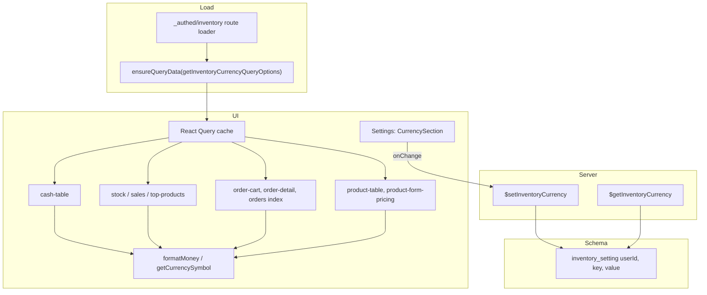

# Inventory review fixes (1–4 and 6)

## Fix 1: Cash table stale inputs

**[`src/components/apps/inventory/cash-table.tsx`](src/components/apps/inventory/cash-table.tsx)**

On the `TableRow` in the `rows.map(...)`, set:

```tsx
key={`${row.id}-${row.label}-${String(row.value)}-${row.quantity}-${row.sortOrder}`}
```

so the row (and its `defaultValue` inputs) remount when refetched data or order changes.

---

## Fix 2: Cash delete confirmation

**[`src/components/apps/inventory/cash-table.tsx`](src/components/apps/inventory/cash-table.tsx)**

In the delete `Button`’s `onClick`, guard the mutation:

```tsx
onClick={() => {
  if (window.confirm('Delete this row?')) {
    deleteMut.mutate({ data: { id: row.id } })
  }
}}
```

---

## Fix 3: Order reference prefixes (remove sortOrder) and cash reordering

### 3a. Remove sortOrder from order reference prefixes

**Schema** — **[`src/server/db/schema/inventory.ts`](src/server/db/schema/inventory.ts)**

- Remove the `sortOrder` column from `inventoryOrderReferencePrefix` (line 25). Do this in the **same schema edit** as Fix 4a so one migration covers both (see Fix 4a for `bun db generate` and `bun db migrate`).

**Server** — **[`src/server/functions/inventory/order-reference-prefixes.ts`](src/server/functions/inventory/order-reference-prefixes.ts)**

- **$getOrderReferencePrefixes**: Remove `sortOrder` from the `select`. Change `orderBy` to `asc(inventoryOrderReferencePrefix.prefix)` only.
- **$createOrderReferencePrefix**: Remove `sortOrder` from the input validator. In `.values({...})` use only `{ userId: user.id, prefix: p }`; remove from `.returning({...})`.
- **$updateOrderReferencePrefix**: Remove `sortOrder` from the input validator. Remove `if (sortOrder !== undefined) set.sortOrder = sortOrder`. Remove `sortOrder` from `.returning({...})`.

**UI** — **[`src/components/apps/inventory/settings/order-reference-prefixes-section.tsx`](src/components/apps/inventory/settings/order-reference-prefixes-section.tsx)**

- Remove state: `newSortOrder`, `setNewSortOrder`, `editSortOrder`, `setEditSortOrder`.
- In `createMut.onSuccess`: remove `setNewSortOrder('')`.
- In `openEdit`: remove `setEditSortOrder(String(p.sortOrder))`.
- In `handleCreate`: `createMut.mutate({ data: { prefix: p } })` (no `sortOrder`).
- In `handleUpdate`: `updateMut.mutate({ data: { id: editingId, prefix: p } })` (no `sortOrder`).
- **Create form**: remove the "Sort order (optional)" `Label` + `Input` block.
- **Table**: remove the "Sort order" `TableHead`; remove the `<TableCell>{p.sortOrder}</TableCell>`. Set `colSpan={2}` in the empty-state row (was 3).
- **Edit dialog**: remove the "Sort order" `Label` + `Input` block.

### 3b. Cash: keep sortOrder and add reordering UI

**Do not** remove `sortOrder` from `inventoryCash` or from [`cash.ts`](src/server/functions/inventory/cash.ts). Add reordering:

**[`src/server/functions/inventory/cash.ts`](src/server/functions/inventory/cash.ts)**

- New server fn **`$reorderCashRow`** (POST, `$$auth`, `$$rateLimit`):
  - Input: `z.object({ id: z.uuid(), direction: z.enum(['up', 'down']) })`.
  - Handler: 1) Get row by `id` and `userId`; if not found `notFound`. 2) Select all cash rows for user `orderBy(asc(sortOrder), asc(id))`. 3) Find index `i` of the row. 4) If `direction==='up'` and `i>0`: neighbour at `i-1`. If `direction==='down'` and `i<len-1`: neighbour at `i+1`. Else return (no-op). 5) Swap `sortOrder`: two `db.update(inventoryCash).set({ sortOrder }).where(...)` — set current to neighbour’s `sortOrder`, neighbour to current’s. 6) Invalidate not needed in handler; client invalidates `inventoryCashQueryKey`.

**[`src/components/apps/inventory/cash-table.tsx`](src/components/apps/inventory/cash-table.tsx)**

- `useMutation` for `$reorderCashRow`; onSuccess invalidate `inventoryCashQueryKey`.
- In the actions cell (same as Delete), add **Up** and **Down** icon buttons before the Delete button: `ChevronUpIcon`, `ChevronDownIcon` from `lucide-react`.
- Up: `onClick={() => reorderMut.mutate({ data: { id: row.id, direction: 'up' } })}`, `disabled={index===0 || reorderMut.isPending}`.
- Down: `onClick={() => reorderMut.mutate({ data: { id: row.id, direction: 'down' } })}`, `disabled={index===rows.length-1 || reorderMut.isPending}`.
- Use `rows.map((row, index) => ...)` so `index` is available. `aria-label="Move up"` / `"Move down"`.

---

## Fix 4: Currency setting (inventory, not user)

### 4a. Schema

**[`src/server/db/schema/inventory.ts`](src/server/db/schema/inventory.ts)**

- **Remove** the `sortOrder` column from `inventoryOrderReferencePrefix` (Fix 3a).
- **Add**:

```ts
export const inventorySetting = pgTable(
  'inventory_setting',
  {
    userId: text('user_id')
      .notNull()
      .references(() => user.id, { onDelete: 'cascade' }),
    key: text('key').notNull(),
    value: text('value').notNull(),
  },
  (t) => [primaryKey({ columns: [t.userId, t.key] })],
)
```

- Export the type and add `userRelations_inventorySetting` and `inventorySettingRelations` (or equivalent) if you use Drizzle relations. Otherwise the minimal table is enough.
- Ensure `primaryKey` is imported from `drizzle-orm/pg-core`.

Then run `bun db generate --name=inventory_add_setting_remove_prefix_sort_order` and `bun db migrate`.

### 4b. Currency server API

**New file: `src/server/functions/inventory/currency.ts`**

- `inventoryCurrencyQueryKey = ['inventory-currency']`
- `getInventoryCurrencyQueryOptions()` — `queryFn: () => $getInventoryCurrency()`, `staleTime` e.g. 2 min.
- `$getInventoryCurrency` (GET, `$$auth`):

`select value from inventory_setting where userId=? and key='currency'`; if no row, return `'EUR'`.

- `$setInventoryCurrency` (POST, `$$auth`, `$$rateLimit`):

input `z.object({ currency: z.string().min(1).max(10) })`.

Upsert `(userId, 'currency', data.currency)` (e.g. `insert ... on conflict (userId, key) do update set value = excluded.value`).

Invalidate `inventoryCurrencyQueryKey` on success (or the caller can invalidate).

### 4c. Format helpers

**New file: `src/lib/utils/format-money.ts`**

- `getCurrencySymbol(currency: string): string`
  - `EUR` -> `'€'`, `USD` -> `'$'`, `GBP` -> `'£'`, `CHF` -> `'Fr.'`; otherwise return `currency`.
- `formatMoney(amount: number, currency: string): string`
  - e.g. `"${Number(amount).toFixed(2)} ${getCurrencySymbol(currency)}"` (or `"${getCurrencySymbol(currency)} ${...}"` if you prefer; keep one consistent style).

### 4d. Preload currency in inventory layout

**[`src/routes/_authed/inventory/route.tsx`](src/routes/_authed/inventory/route.tsx)**

Change the loader to:

```ts
loader: async ({ context: { queryClient } }) => {
  await queryClient.ensureQueryData(getInventoryCurrencyQueryOptions())
  return { crumb: 'Inventory' }
}
```

(Import `getInventoryCurrencyQueryOptions` from `@/server/functions/inventory/currency`.)

### 4e. Currency section in Settings

**New file: `src/components/apps/inventory/settings/currency-section.tsx`**

- Use `Section` from `../section` with `title="Currency"` and `description="Default currency for amounts in inventory (products, orders, cash, statistics)."`.
- `useSuspenseQuery(getInventoryCurrencyQueryOptions())` for `currency`.
- `useMutation` for `$setInventoryCurrency`; on success invalidate `inventoryCurrencyQueryKey`.
- A `Select` (from `@/components/ui/select`) with options: EUR, USD, GBP, CHF.

`value={currency}`, `onValueChange={(v) => setMut.mutate({ data: { currency: v } })}`.

**[`src/routes/_authed/inventory/settings.tsx`](src/routes/_authed/inventory/settings.tsx)**

- Import `CurrencySection` and `getInventoryCurrencyQueryOptions`.
- In the loader, add `ensureQueryData(getInventoryCurrencyQueryOptions())` to the existing `Promise.all` (or run it before/after; it’s idempotent).
- In the component, render `<CurrencySection />` first (after the `h2`), then the existing sections.

### 4f. Use currency everywhere amounts are shown

In each place, call `useSuspenseQuery(getInventoryCurrencyQueryOptions())` (or receive `currency` from a parent that does) and replace hardcoded `€` / `X.toFixed(2) + ' €'` with `formatMoney(..., currency)` or `getCurrencySymbol(currency)` for labels.

| File | Changes |

|------|---------|

| [`cash-table.tsx`](src/components/apps/inventory/cash-table.tsx) | `useSuspenseQuery(getInventoryCurrencyQueryOptions())`. Header "Value (€)" -> `"Value (" + getCurrencySymbol(currency) + ")"`. Placeholder "e.g. 1 € coin" -> `"e.g. 1 " + getCurrencySymbol(currency) + " coin"`. Row total and footer total: `formatMoney(Number(row.value)*row.quantity, currency)`, `formatMoney(total, currency)`. |

| [`stock-stats-section.tsx`](src/components/apps/inventory/stats/stock-stats-section.tsx) | `useSuspenseQuery(getInventoryCurrencyQueryOptions())`. The four card values: `formatMoney(stockStats.totalWorthExTax, currency)` etc. |

| [`top-products-section.tsx`](src/components/apps/inventory/stats/top-products-section.tsx) | `useSuspenseQuery`, and in `valueToString`: `(t) => formatMoney(t.revenue, currency)` / `formatMoney(t.benefit, currency)`. |

| [`sales-stats-section.tsx`](src/components/apps/inventory/stats/sales-stats-section.tsx) | `useSuspenseQuery`. Three cards: `formatMoney(stats.totalSalesTaxIncluded, currency)` etc. YAxis `tickFormatter` and `ChartTooltipContent` `formatter`: `(v) => formatMoney(Number(v), currency)`. |

| [`order-cart.tsx`](src/components/apps/inventory/order-cart.tsx) | `useSuspenseQuery`. Line total, "Total (ex. tax)", "Total (incl. tax)": `formatMoney(..., currency)`. |

| [`order-detail.tsx`](src/components/apps/inventory/order-detail.tsx) | `useSuspenseQuery`. Unit price, line total, "Total (ex. tax)", "Total (incl. tax)", "Benefit (est.)": `formatMoney(..., currency)`. |

| [`orders/index.tsx`](src/routes/_authed/inventory/orders/index.tsx) | In the route component, `useSuspenseQuery(getInventoryCurrencyQueryOptions())`. In the "Total (incl. tax)" column cell: `formatMoney(Number(row.original.totalTaxIncluded), currency)`. |

| [`product-form-pricing.tsx`](src/components/apps/inventory/product-form/product-form-pricing.tsx) | `useSuspenseQuery`. Labels: "Price (ex. tax) €" -> `"Price (ex. tax) " + getCurrencySymbol(currency)`, same for "Price (incl. tax)". Calculated `priceIncl` display: `formatMoney(priceIncl, currency)`. |

| [`product-table.tsx`](src/components/apps/inventory/product-table.tsx) | `useSuspenseQuery`. The three price/cost cells that currently append `" €"`: use `formatMoney(..., currency)`. |

Do **not** change `toFixed(2)` (or equivalent) in server-only code (`cash.ts`, `orders.ts`, `products.ts`); those are for DB storage, not display.

---

## Fix 6: Section + crumb

### 6a. Cash page: wrap in `Section`

**[`src/routes/_authed/inventory/cash.tsx`](src/routes/_authed/inventory/cash.tsx)**

- Import `Section` from `@/components/apps/inventory/section`.
- Replace the `div` with `h2` + `CashTable` by:

  ```tsx
  <Section
    title="Cash"
    description="Track coins and bills by denomination; totals update automatically."
  >
    <CashTable />
  </Section>
  ```

- Remove the `title` import from `@/components/ui/typography` if it is no longer used.

### 6b. Inventory index: return `crumb`

**[`src/routes/_authed/inventory/index.tsx`](src/routes/_authed/inventory/index.tsx)**

In the loader, after the existing `Promise.all([...])`, add:

```ts
return { crumb: 'Products' }
```

(`useCrumbs` will pick it up for breadcrumbs.)

---

## Implementation order

1. **Fix 1 and 2** — [`cash-table.tsx`](src/components/apps/inventory/cash-table.tsx): `key` on `TableRow`, and `window.confirm` in the delete handler.
2. **Fix 3b (cash reorder)** — [`cash.ts`](src/server/functions/inventory/cash.ts): add `$reorderCashRow`. [`cash-table.tsx`](src/components/apps/inventory/cash-table.tsx): Up/Down buttons and `useMutation` for `$reorderCashRow`.
3. **Fix 3a + Fix 4a (schema and order ref prefixes)** — [`inventory.ts`](src/server/db/schema/inventory.ts): remove `sortOrder` from `inventoryOrderReferencePrefix`, add `inventorySetting`. [`order-reference-prefixes.ts`](src/server/functions/inventory/order-reference-prefixes.ts): remove all `sortOrder`. [`order-reference-prefixes-section.tsx`](src/components/apps/inventory/settings/order-reference-prefixes-section.tsx): remove sortOrder state, form fields, table column. Then run `bun db generate --name=inventory_add_setting_remove_prefix_sort_order` and `bun db migrate`.
4. **Fix 4b–4e** — Currency API, `format-money` util, inventory route loader, `CurrencySection`, and Settings wiring.
5. **Fix 4f** — Replace `€` / `X.toFixed(2) + ' €'` in the 9 files using `formatMoney` / `getCurrencySymbol` and `useSuspenseQuery(getInventoryCurrencyQueryOptions())`.
6. **Fix 6** — [`cash.tsx`](src/routes/_authed/inventory/cash.tsx) Section, [`index.tsx`](src/routes/_authed/inventory/index.tsx) `crumb`.

---

## Diagram: currency flow



---

## Out of scope (per your note)

- **Fix 5 (tests)** and **Ideas to extend the app** are left for later.
