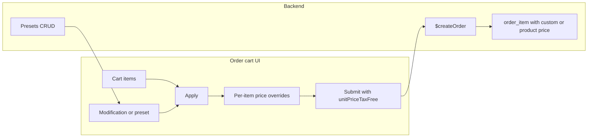

# Order price modification and presets

## Current behavior

- **Order creation**: User picks reference prefix, description, adds products (with quantity). Submit sends `items: [{ productId, quantity }]`. Server derives unit prices from product catalog and writes `order_item.unit_price_tax_free` / `unit_price_tax_included` ([orders.ts](src/server/functions/inventory/orders.ts) lines 402–414).
- **Cart**: [order-cart.tsx](src/components/apps/inventory/order-cart.tsx) holds `CartItem` with `productId`, `quantity`, `name`, `priceTaxFree`, `vatPercent`. Totals are computed from product prices only; no overrides.

## Target behavior

1. **After choosing products**, user can apply a **price modification** to all line items:

- **Direction**: increase or decrease.
- **Kind**: flat (fixed amount per unit) or relative (percentage).
- **Value**: number (e.g. 5 for €5 or 10 for 10%).

2. Modified unit prices are shown in the items list and in totals; on submit, those prices are sent and stored.
3. User can **save** the current modification as a **preset** (name) and later **select a preset** to apply (e.g. "Wholesale -15%", "Event +5€").

## Architecture

- **Client**: Holds optional per-item override `unitPriceTaxFree` (or a single modification that is applied to compute overrides). Submits `items: [{ productId, quantity, unitPriceTaxFree? }]`.
- **Server**: Create order accepts optional `unitPriceTaxFree` per item; if present, use it (and product `vatPercent` for tax-incl); else use product `priceTaxFree`. Presets stored in DB; CRUD API for list/create/update/delete.

## Implementation

### 1. Backend: create order accepts optional unit prices

- **Schema** ([src/server/functions/inventory/orders.ts](src/server/functions/inventory/orders.ts)): Extend `orderCreateSchema` so each item is:
  - `productId`, `quantity` (unchanged),
  - `unitPriceTaxFree` optional number (e.g. `z.number().min(0).optional()`).
- **Handler**: When inserting order items, for each item:
  - If `unitPriceTaxFree` is provided and valid, use it; else use `productMap.get(i.productId).priceTaxFree`.
  - Compute `unitPriceTaxIncluded` with existing `priceTaxIncluded(product.priceTaxFree or override, product.vatPercent)` (override does not change VAT).
- **Validation**: Reject negative `unitPriceTaxFree`; optionally sanity-check (e.g. not more than 100× product price) to avoid typos.

### 2. Backend: price modification presets (new table + API)

- **Schema** ([src/server/db/schema/inventory.ts](src/server/db/schema/inventory.ts)): New table e.g. `orderPriceModificationPreset`:
  - `id` (uuid), `userId` (FK to user), `name` (text), `type` ('increase' | 'decrease'), `kind` ('flat' | 'relative'), `value` (numeric, e.g. 10 for 10 or 10%).
  - Index on `userId`; optional `sortOrder` for display.
- **Migration**: New Drizzle migration adding this table.
- **API** (new file e.g. `src/server/functions/inventory/order-price-modification-presets.ts`): Same pattern as [order-reference-prefixes.ts](src/server/functions/inventory/order-reference-prefixes.ts):
  - `$getOrderPriceModificationPresets` (list by user).
  - `$createOrderPriceModificationPreset` (name, type, kind, value).
  - `$updateOrderPriceModificationPreset` (id, optional name/type/kind/value).
  - `$deleteOrderPriceModificationPreset` (id).
- **Validation**: `type` enum, `kind` enum, `value` > 0; for relative, value typically 0–100; for flat, in currency units (no DB constraint).

### 3. Form and submit payload (client)

- **[lib/forms/order-cart.ts](src/lib/forms/order-cart.ts)**: Extend submit schema so each item can have optional `unitPriceTaxFree: z.number().min(0).optional()`. Submit payload type then includes optional per-item price.
- **Order cart form state** ([order-cart.tsx](src/components/apps/inventory/order-cart.tsx)):
  - Keep `CartItem` as is; add optional `unitPriceTaxFree?: number` (display/override). When absent, use product `priceTaxFree`; when present, use it for line total and totals.
  - Add state for “current modification” (for applying or saving as preset): `{ type, kind, value }` or null. Optionally keep “selected preset” (id or null) for UX.

### 4. Order cart UI: modification block and apply logic

- **Placement**: After the “Items” list, before the “Total” and “Create as prepared / Create and mark paid” buttons.
- **Block contents**:
  - **Preset dropdown**: Load presets via `getOrderPriceModificationPresetsQueryOptions()`. When user selects a preset, fill type/kind/value (and optionally auto-apply).
  - **Manual fields**: Type (increase/decrease), kind (flat / relative), value (number input). “Apply” button: for each cart item, compute `effectivePriceTaxFree` from item’s `priceTaxFree` and the modification (see formula below), set `unitPriceTaxFree` on that item so the list and totals update.
  - **Clear**: Button to remove all per-item overrides (and clear modification state).
  - **Save as preset**: If a modification is applied, “Save as preset” opens a small dialog/input for name, then call `$createOrderPriceModificationPreset` and optionally add to local preset list.
- **Price formula** (same for all items; apply to base `priceTaxFree`):
  - Increase + flat: `base + value`
  - Increase + relative: `base * (1 + value / 100)`
  - Decrease + flat: `max(0, base - value)`
  - Decrease + relative: `base * (1 - value / 100)` (clamp to ≥ 0)
- **Submit**: When building payload, send each item as `{ productId, quantity, unitPriceTaxFree: item.unitPriceTaxFree ?? undefined }` so overrides are persisted; if no override, omit and server uses product price.

### 5. Presets management in Settings

- **New section** (e.g. `order-price-modification-presets-section.tsx`) in inventory settings: List presets (name, type, kind, value), add new, edit, delete. Reuse patterns from [order-reference-prefixes-section.tsx](src/components/apps/inventory/settings/order-reference-prefixes-section.tsx).
- **Settings route**: Register the new section on the inventory settings page (where prefix/tags/currency are).

## Files to add

- `src/server/db/schema/` – extend inventory schema with `orderPriceModificationPreset` (and relations if needed).
- New migration in `.drizzle/` for the preset table.
- `src/server/functions/inventory/order-price-modification-presets.ts` – CRUD server functions and query options.
- `src/components/apps/inventory/settings/order-price-modification-presets-section.tsx` – Settings UI for presets.

## Files to change

- [src/server/functions/inventory/orders.ts](src/server/functions/inventory/orders.ts) – extend create schema and handler to accept and use optional `unitPriceTaxFree` per item.
- [src/lib/forms/order-cart.ts](src/lib/forms/order-cart.ts) – optional `unitPriceTaxFree` in item schema.
- [src/components/apps/inventory/order-cart.tsx](src/components/apps/inventory/order-cart.tsx) – add `unitPriceTaxFree` to cart items for overrides; add modification block (preset + manual apply/clear/save as preset); submit with overrides.
- Inventory settings page – include the new presets section (locate the parent settings component and add the section).

## Edge cases

- **Empty cart**: Disable “Apply” / preset apply when there are no items.
- **Rounding**: Store and display with 2 decimals (existing money scale). Use the same rounding when applying modification (e.g. `toFixed(2)` before storing in overrides).
- **Preset delete**: If user deletes a preset, order cart only loses the preset option; any already-applied prices remain (they are stored as overrides on items).
